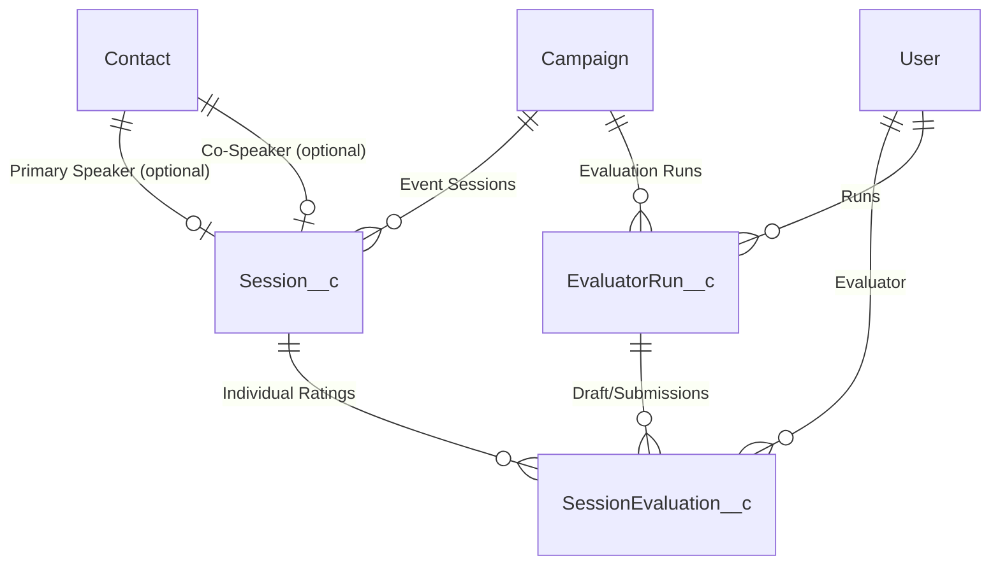

# Session Evaluation App – ERD

## 1. Entity Relationship Diagram (Mermaid)

## 2. Object Role Summary

| Object                 | Purpose                                | Notes                                                      |
| ---------------------- | -------------------------------------- | ---------------------------------------------------------- |
| Campaign (Standard)    | Represents the Event                   | One Campaign groups Sessions & evaluator runs              |
| Session\_\_c           | Proposed session submission            | Links to Campaign & aggregated scores                      |
| Speaker\_\_c           | Canonical speaker profile              | PII hidden from evaluators                                 |
| SessionSpeaker\_\_c    | Junction Session–Speaker               | Supports >2 speakers & role metadata                       |
| SessionEvaluation\_\_c | Single evaluator’s rating of a session | Scores + comments, private visibility                      |
| EvaluatorRun\_\_c      | Evaluator’s overall run for a Campaign | Replaces assignment object; holds target counts & progress |
| User (Standard)        | Internal evaluator / organizer         | Security context                                           |

## 3. Cardinality & Rationale

- Campaign → Sessions: 1:N (an event has many sessions).
- Session → Contact (Primary/Co): 0..1 each (optional lookups for post-selection notifications; speakers stored as direct fields during submission).
- Session → Evaluations: 1:N (many evaluators rate a session; uniqueness enforced per user).
- EvaluatorRun\_\_c: one per evaluator per Campaign (acts as assignment; design assumes 1 active run; add Phase field if phased model later).
- EvaluatorRun → Evaluations: 1:N (groups draft & submitted evaluations for summary/finalization).

## 4. Key Design Decisions

1. **Speaker Data Storage**: Speaker information (name, email, job title, bio) stored directly on Session\_\_c (max 2 speakers: primary + co-speaker). No separate Speaker or junction objects needed.
2. **Contact Conversion**: Optional Contact lookups (`PrimarySpeakerContact__c`, `CoSpeakerContact__c`) enable post-selection email notifications via standard Salesforce features (Process Builder, Flow, Email Alerts).
3. **Evaluator Privacy**: OWD Private on SessionEvaluation\_\_c ensures evaluators cannot view others' scores.
4. **Aggregation Strategy**: Persist sums & counts to avoid expensive real‑time aggregate queries at scale.
5. **Synchronization Point**: Final campaign-wide aggregation deferred until all EvaluatorRuns for the Campaign are finalized (avoids repeated recalculation). EvaluatorRun now encapsulates assignment + progress.

## 5. Assumptions

- Each evaluator must complete all sessions (assumption: full coverage) before final campaign score computation. If partial coverage later, add Scope field.
- Speaker data stored as text fields on Session; uniqueness NOT enforced (same speaker can submit multiple sessions).
- Contact conversion happens AFTER selection (organizer-initiated, typically via Flow or Apex batch for selected sessions).
- Session selection (Selected / Not Selected) occurs only after final aggregated scores exist.

## 6. Future Extensibility Hooks

| Concept                    | Extension Path                                                    |
| -------------------------- | ----------------------------------------------------------------- |
| Additional Metrics         | Add fields to SessionEvaluation\_\_c + update aggregation service |
| Anonymous Feedback         | Replace Lookup(User) with text alias & separate private mapping   |
| Multiple Evaluation Phases | Version field on SessionEvaluation**c or new Phase**c object      |

## 7. Security Considerations (ERD Impact)

- Session\_\_c fields containing speaker PII (emails, bios, job titles, session link) must have field-level restrictions for evaluator permission sets.
- Contact lookups remain hidden from evaluators (organizer/admin only).

## 8. Open Questions (To Validate Later)

- Contact conversion timing: automatic on selection OR manual admin action?
- Duplicate contact handling: match by email before creating new Contact?
- Need for partial finalization (some evaluators excluded if they miss deadline)?
- Do organizers ever edit evaluations (administrative overrides)?
